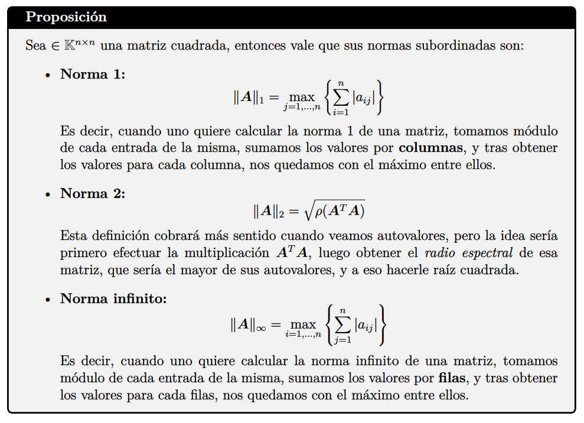

$$ cond_*(A) = || A ||_* * || A^{-1} ||_* $$

$$ cond_*(A) \geq \sup_{H \text{ singular}} \{ \frac{|| A || } {|| A - H || }\}$$

$$ cond_*(A) \leq \inf_{H \text{ singular}} \{ \frac{|| A - H|| } {|| A || }\}$$

$$A \text{ es definida positiva } \iff A=LU \text{ con } U_{ii} > 0 \text{ para } \forall i \in \{1 .. n\}$$

$$e \in Ker(A^T) \iff e \perp c(A)$$

$$A \text{ inversible} \iff det(A) = 0 \iff \exists v \neq 0 | Av = 0$$

$$A \text{ diagonalizable} \iff \text{los vectores columna de A forman una base} \iff $$

$$ A \text { no es inversible } \iff \lambda=0 \text{ es autovalor}$$

$$ A\in K^{N\times N} \text { es diagonalizable } \iff \text{ Existen N autovectores LI (vectores columna de A)}$$

$$ A\in K^{N\times N} \text { es diagonalizable } \iff \text{ Para todo } \lambda_i \text{ autovalor de A, vale que } mg_A(\lambda_i) = ma_A(\lambda_i)$$

$$A, B \in K^{N\times N} \text{ son semejantes } \iff \exists c \in K^{N \times N} \text{ tal que } A = CBC^{-1}$$ 

$$ A\in K^{N\times N} \text { es diagonalizable } \iff A = PDP^{-1}$$

$$ A\in K^{N\times N} \text { es diagonalizable } \iff A^m = PD^mP^{-1}$$

$$P(x) = [ P ] x = \sum (x * e_i) * e_i, \text{ con } e_i \text{ los vectores columnas de la matriz ortogonal de P}$$

$$1 \leq mg_a(\lambda) \leq ma_a(\lambda)$$

$$ mg_a(\lambda) = dim(E_\lambda)$$

$$ ma_a(\lambda) = \text{ "multiplicidad de lambda como raíz en x(lambda)" }$$

$$ \text{A y B son semejantes si } A= CBC^{-1}$$

$$ A \text{ es diagonalizable si es semejante a una matriz diagonal}$$

$$ A \text{ simetrica} \rightarrow det(A) = \prod_i \lambda_i$$

