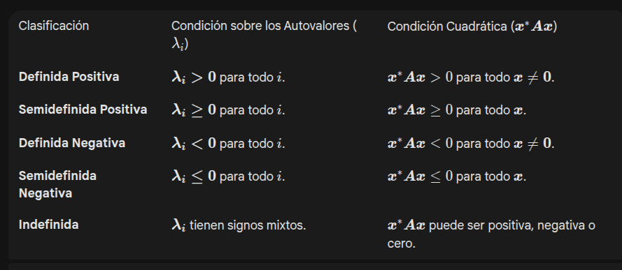

# Temas segundo parcial

## 📊 Existencia de Descomposiciones Matriciales

| Descomposición | Forma | Tipo de Matriz Requerida | ¿Existe para **Toda Matriz** $\boldsymbol{A}$? | Notas Clave |
| :--- | :--- | :--- | :--- | :--- |
| **SVD** (Valores Singulares) | $\boldsymbol{A} = \boldsymbol{U} \boldsymbol{\Sigma} \boldsymbol{V}^*$ | Ninguna (Cualquier matriz $m \times n$). | **SÍ** ✅ | Es la factorización más general y universal. |
| **Schur** (Triangularización) | $\boldsymbol{A} = \boldsymbol{U} \boldsymbol{T} \boldsymbol{U}^*$ | Cuadrada ($n \times n$). | **SÍ** (Si es cuadrada) ✅ | $\boldsymbol{T}$ es triangular superior y $\boldsymbol{U}$ es unitaria. |
| **QR** (Ortogonal/Triangular) | $\boldsymbol{A} = \boldsymbol{Q} \boldsymbol{R}$ | Ninguna (Cualquier matriz $m \times n$ con $m \ge n$). | **SÍ** ✅ | $\boldsymbol{Q}$ es ortogonal/unitaria, $\boldsymbol{R}$ es triangular superior. |
| **LU** (Lower/Upper) | $\boldsymbol{A} = \boldsymbol{L} \boldsymbol{U}$ | Cuadrada ($n \times n$). | **NO** ❌ | Solo existe si todos los **menores principales** son distintos de cero. Siempre existe con permutación: $\boldsymbol{P}\boldsymbol{A} = \boldsymbol{L}\boldsymbol{U}$. |
| **Cholesky** | $\boldsymbol{A} = \boldsymbol{L} \boldsymbol{L}^*$ (o $\boldsymbol{L}\boldsymbol{L}^T$) | Cuadrada ($n \times n$), **Hermitiana** (Simétrica), y **Definida Positiva**. | **NO** ❌ | Es la descomposición más restrictiva. Es única si existe. |

## ¿Cómo diagonalizo una matríz?

#### Existencia
$A \text{ diagonalizable} \\
\iff \text{Los vectores columna de A forman una base} \\
\iff \text{Existen n autovectores LI (vectores columna de A)} \\
\iff \text{Para todo } \lambda_i \text{ autovalor de A, vale que } mg_A(\lambda_i) = ma_A(\lambda_i) \\
\iff \text{Es semejante a una matriz diagonal} \\
\iff A = PDP^{-1} \\
\iff A^m = PD^mP^{-1}$

#### Procedimiento:
> 1. Determinar si A es diagonalizable.
> 2. Hallar autovalores $\lambda_1, ..., \lambda_n$ de A. 
> - Definir $D = \begin{pmatrix} \lambda_1 & 0 & ... & 0 & 0 \\
0 & \lambda_2 & ... & 0 & 0 \\
... & ... & ... & ... & ... \\
... & ... & ... & ... & \lambda_n \\
\end{pmatrix}$
> 3. Hallar autovectores $v_1, ..., v_n$ de A. 
> - Definir $Q = (v_1| ... | v_n)$.
> 4. Escribir $A = QDQ^*$

## ¿Cómo calculo una descomposicion Shur?

Toda matriz $A$ es unitariamente semejante a una matríz triangular superior ($\exists U \text{ unitaria y } T \text{ triangular: } A=UTU^*$).

Cualquier matríz cuadrada $A$ puede ser escrita como $A = QUQ^*$, con $Q$ matríz unitaria ($Q* = Q^{-1}$) y $D$ diagonal.

##### <u>Procedimiento:</u>
> 1. Encontrar un autovector
> 2. Completar una b.o.n para $Q_1$ con el autovector
> 3. Calcular $Q_1^* A Q_1$
> 4. Repetir los pasos anteriores para la submatriz del resultado, pisando los valores en las submatrices de $Q$ y $A$.

## ¿Cómo calculo una descomposicion SVD?

La descomposición en valores singulares de una matríz $A \in \mathbb{C} ^{m\times n}$ es un producto de la forma
$$A = U 
\Sigma V^*$$

Con:
- $U \in \mathbb{C}^{m \times m}$: Las columnas $u_1, ..., u_m$ vienen dadas por la relación $Av_j = \sigma_j u_j$ con $j=1...n$.
- $V \in \mathbb{C}^{n \times n}$: Las columnas son los autovectores (de $A^*A$). 
- $\Sigma \in \mathbb{C}^{m \times n}$: Diagonal real y no negativa.

Pueden pasar dos casos: 
- $m>n$: En tal situacion se completan las columnas de $U$ para tener una b.o.n en $\mathbb{C}^m$.
- $m<n$: Hay varios $v_j$ asociados a un autovalor 0. Si $\sigma_j=0$ para algun $j\leq \min(n,m)$ entonces se puede elegir $u_j$ completando la ortonormalidad de las columnas de $U$.

##### <u>Procedimiento:</u>
Sea $A\in\mathbb{C}^{m\times n}$...
> 1. Calcular $A^*A$
> 2. Calcular los autovalores y autovectores de $A^*A$
> 3. Formar las matrices $U, \Sigma, V^T$:
> - $V$ son los autovectores normalizados de $A^*A$.
> - $\Sigma$ es la matriz diagonal $\mathbb{C}^{m\times n}$ con los $\sigma_i = \sqrt{\lambda_i}$.
> - $U$ la calculamos con la relación $Av_i = \sigma_i u_i$ para cada $v_i$ $(i = 1...n)$ y luego completando una base ortonormal de para $u_n ... u_m$. 

Calcular SVD para $A^*$ sale de...
$$A^* = (U \Sigma V^*)^* = V \Sigma^t U^*$$

#### Propiedades para $A=U\Sigma V^*$
Sea también $r = rk(A) = \# \{ \sigma_i \in \mathbb{K}_{\neq 0}: \text{ valores singulares no nulos de } A\}$
- $Im(A) = < u_1, ..., u_r >$
- $Im(A^t) = < v_1, ..., v_r >$
- $Nu(A) = < v_{r+1}, ..., v_{n} >$
- $Nu(A^t) = < u_{r+1}, ..., u_{m} > = Nu(A^tA)$
- $||A||_2 = \sigma_1(A)$

## Procesos de Markov.

#### Proceso de Markov
$v^{(k+1)} = Av^{(k)}$

#### Matríz de transición
Una matriz de transición $A$ cumple las siguientes propiedades:
- $A_{ij} \geq 0$
- $\sum_i A_ij = 1$, $\forall j$
- 1 es autovalor de $A$.
- Si $\lambda$ es autovalor entonces $|\lambda| < 1$.
- $mg(\lambda) = ma(\lambda)$
- No toda matríz de Markov es diagonalizable, pero si lo es $A = PDP^{-1} \rightarrow v^{(k+1)} = A^k v^{(0)} = PD^{k}P^{-1}v^{(0)}$

#### Existencia de estado límite/equilibrio
Un vector $v$ se dice estado de equilibrio si $Av=v$. Es un autovector asociado para $\lambda=1$.

Toda matriz de Markov tiene estado de equilibrio: $Av^* = v^*$

#### Convergencia de estado límite/equilibrio

El método ($v^{(k+1)}=Av^{(k)}$) converge para cualquier $v^{(0)} \iff \\ \exists ! \lambda_i : \text{ autovalor de A tal que } (\lambda_i = 1 \land (\forall \lambda_j: \text{ autovalor de A: } \lambda_j \neq \lambda_i \rightarrow |\lambda_j|<1)) \\ \iff \exists A^{\inf} \\ \iff \text{ la cadena de Markov asociada es irreducible}$ 
 

##### Cadenas reducibles o irreducibles
- Se dice que una **cadena de Markov es irreducible** si $dim(Ker(A-I))=dim(E_A(\lambda=1)) = 1$.
- Si la **cadena de Markov es reducible** ($dim(E_A(\lambda=1))$) entonces la convergencia depende de $v^{(0)}$. 

    Si $v^{(0)}$ es ortogonal a los autovectores asociados a los autovalores de módulo 1, entonces $v^{(k)}$ sí puede converger. 
    Si $v^{(0)}$ tiene componente en dirección de esos autovectores, entonces $v^{(k)}$ no converge (por ejemplo, oscila).

## Cuadrados mínimos
Queremos aproximar una solución de $Ax=b$.

$$||Ax - b|| \rightarrow 0$$

Para resolverlo usamos ecuaciones normales
$$A^tAx= A^tb$$
$$x=(A^tA)^{-1}A^tb$$

Props:
- Si existen soluciones para $Ax=b \rightarrow z=A^tb$ es solucion. Si hay infinitas soluciones, $z=A^tb$ es la solucion de norma 2 mínima.
- $Ax=b$ tiene solucion $\iff AA^tb = b$
- Las ecuaciones normales no están bien condicionadas por eso las soluciones usan QR o SVD ($\text{cond}(A^tA) = \text{cond}_2(A)²$ y $\text{cond}_2(A) = \frac{\sigma_1}{\sigma_n}$).
- $A \text{ tiene columnas LI} \iff \text{ Cuadrados mínimos tiene única solución}$.

Desarrollo de la fórmula: 
- Aparece minimizando una función de error $L(y, \hat{y}) = (y-\hat{y})^2$ o también $E = \sum_{i=1}^n (y_i-\hat{y_i})^2$.
- Luego, buscamos...
$$\argmin_{a,b}{E(a,b)}=\argmin_{a,b}{\sum_{i=1}^n (y_i-\hat{y_i})^2}=\argmin_{a,b}{\sum_{i=1}^n (y_i-(a*x_i+b))^2}$$
- O también, matricialmente..
$$\argmin_{a,b}{
    \begin{Vmatrix}
    \begin{pmatrix}
    y_0 \\
    ... \\
    y_n
    \end{pmatrix}
    - 
    \begin{pmatrix}
    a*x_0+b \\
    ... \\
    a*x_n+b
    \end{pmatrix}
    \end{Vmatrix}^2_2
} = 
\argmin_{a,b}{
    \begin{Vmatrix}
    \begin{pmatrix}
    y_0 \\
    ... \\
    y_n
    \end{pmatrix}
    - 
    \begin{pmatrix}
    x_0 & 1 \\
    ... \\
    x_n & 1
    \end{pmatrix}

    \begin{pmatrix}
    a \\
    b 
    \end{pmatrix}
    \end{Vmatrix}_2^2
} =
\argmin_{a,b}{
    \begin{Vmatrix}
    Y - A \begin{pmatrix} a \\ b \end{pmatrix} 
    \end{Vmatrix}_2^2
}
$$

Si llamamos $\hat{X}$ a los parámetros $\begin{pmatrix} a \\ b \end{pmatrix}$ entonces la solución apróximada queda..
$$\argmin_{\hat{X}}{
    \begin{Vmatrix}
    A\hat{X}-b
    \end{Vmatrix}_2^2}$$

## Métodos Iterativos. Convergencia.

$$A = D + L + U$$

Definimos un método iterativo de la siguiente forma...
$$X = TX + c$$

Teo: $x^{n} \text{ converge } \iff \rho(T) < 1$

Con: $\rho(T) = \max{ |\lambda| : \lambda \text{ autovalor de T} }$

A veces se escribe $B=T$, como la matríz de iteración.

#### Método Jacobi

$x^{(n+1)} = -D^{-1}(L+U)x^{(n)} + D^{-1}b$

#### Método Gauss-Seidel
$x^{(n+1)} = -(D+L)^{-1}Ux^{(n)} + (D+L)^{-1}b$

#### Propiedades
- $T = -M^{⁻1}N \land \lambda \text{ autovalor de T} \iff det(\lambda M + N) = 0$ 
- El método converge en $n$ pasos si $T^n = 0$.
- $A$ matriz cuadrada y tridiagonal ($|a_{ij}=0| si |j-i|>1$) con $a_{ii}\neq 0$ para todo $i=1...n$. Entonces $\rho(B_{GS}) = \rho(B_j)^2$
- Para toda norma subordinada $||.||$ vale que:
    $$\rho(B) = lim_{n \rightarrow \inf} || B^n ||^{1/n}$$
- $x^* = Bx^* + c$
- $err_k = x_k - x^* = B_{gs} * err_{k-1} = B_{gs} * (x_{k-1} - x^*)$

#### Radio espectral
El radio espectral $\rho(T)$ de la matriz de iteración $T$ determina si un método iterativo converge y qué tan rápido lo hace. 
- Si $\rho(B)<1$: el método converge .
- Si $\rho(B)=1$: puede no converger o converger muy lentamente.
- Si $\rho(B)>1$ : el método diverge .
- Cuanto menor sea $\rho(B)$, más rápida será la convergencia .

### Propiedades

- $A$ es hermitana $\iff$ $A=A^*$. 

- Las matrices hermitianas tienen autovalores reales y son diagonalizables ortogonalmente con $A=UDU*$

- Las matrices hermitanas son un subconjunto de las normales.

- $A$ hermitiana -> todo sus autovectores son ortogonales entre si.

- $A$ simétrica real $\rightarrow$ $A$ hermitana. 

- $A$ es normal $\iff$ $A^*A = AA^*$

- <u>Teorema Espectral</u>: Si $A$ es normal, entonces se puede diagonalizar en una b.o.n como $A=QDQ^*$. 

- $A^tA$ es simétrica

- $\text{max } ||Ax||_2 = \text{max}_i |\sigma_i|$

- $\text{min } ||Ax||_2 = \text{min}_i |\sigma_i|$

- $||UA|| = ||A||, \text{ U matriz unitaria}$

- Si $M$ es real y simétrica y $v,w$ son autovectores de autovalores diferentes, entonces $v, w$ son ortogonales.

- Pseudoinversa: $A^{+} = (A^tA)^{-1}A^t$

